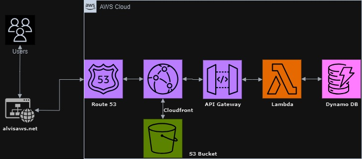

# AWS Cloud Resume Challenge

This repository contains my solution to the [AWS Cloud Resume Challenge](https://cloudresumechallenge.dev/docs/the-challenge/aws/). The challenge involes creating a resume website hosted on AWS, using various AWS services. 

## Architecture 

The following are the AWS Services used:
- AWS Route53
- AWS CloudFront
- AWS API Gateway
- AWS S3
- AWS Lambda
- AWS DynamoDB
